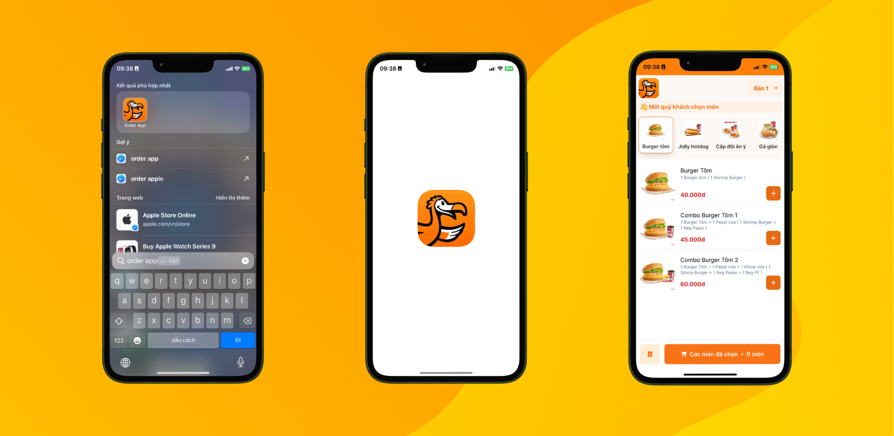

# Order App - Web app gọi món tại nhà hàng

## Project Description:

Ứng dụng cho phép gọi món tại nhà hàng mà không cần thông qua nhân viên.

Ứng dụng gồm 3 phân hệ (Admin, Nhân viên, Khách hàng) với các chức năng sau:

### Chức năng cơ bản:

#### Phân hệ admin:

- Đăng nhập
- Xem lịch sử đơn hàng
- Thêm/Sửa/Xóa món ăn
- Thêm/Sửa/Xóa danh mục món ăn
- Thêm/Sửa/Xóa bàn ăn
- Thêm/Sửa/Xóa nhân viên

#### Phân hệ nhân viên:

- Xem danh sách gọi món của khách hàng
- Sắp xếp thứ tự thực hiện món ăn tùy theo mong muốn của người pha chế
- Đánh dấu đã hoàn thành/tạm hết món cho món ăn
- Xem danh sách bàn ăn
- Tính tiền

#### Phân hệ khách hàng:

- Gọi món
- Hủy món
- Xem lại lịch sử các món đã gọi

### Các chức năng tăng cường trải nghiệm người dùng:

- Dễ dàng kéo thả để sắp xếp thứ tự món ăn
- Các trạng thái món ăn được đồng bộ Realtime

---

## Giao diện:

### Màn hình gọi món dành cho khách hàng

### Màn hình dành cho nhân viên

---

#### Tài khoản test

##### Phân hệ admin

- username: **admin** Password: **admin**

##### Phân hệ nhân viên

- username: **chef** Password: **chef**
